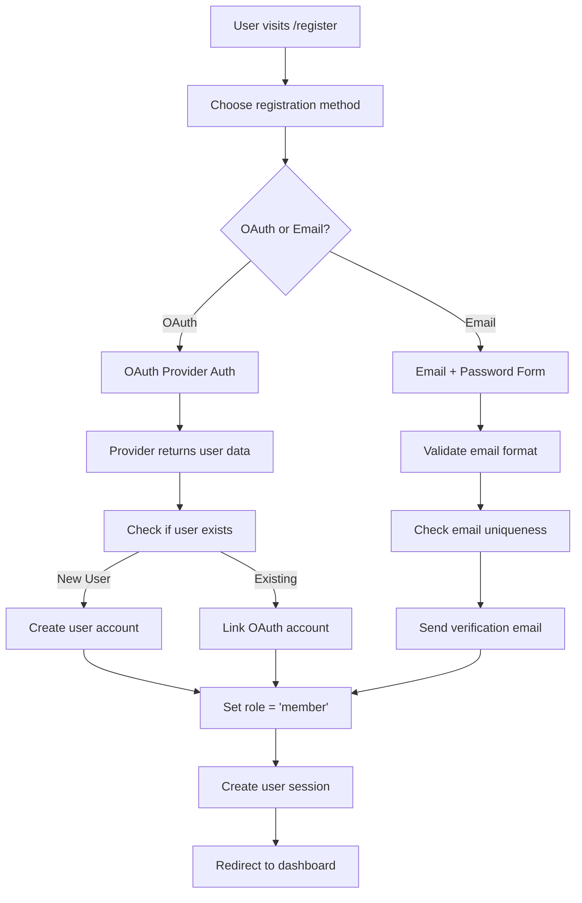
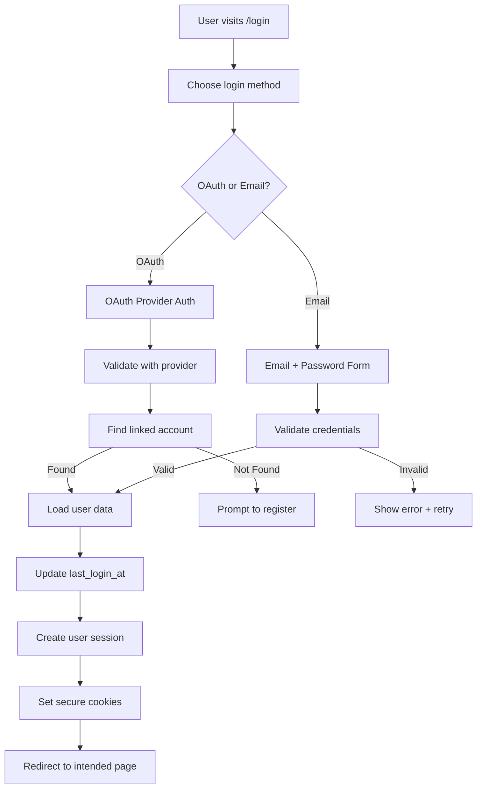
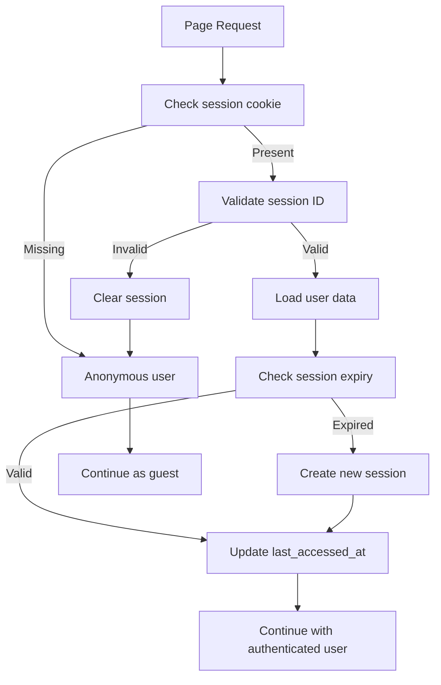

# StackAuth Integration Architecture
## CCSF CS Club Authentication System Design Document

**Phase:** 4 - Infrastructure & Security  
**Priority:** High (required for election system security)  
**Version:** 1.0  
**Date:** 2025-09-07

---

## Executive Summary

This document presents a comprehensive technical architecture plan for implementing StackAuth authentication across the CCSF CS Club website and election system. Based on extensive research and analysis of the existing codebase, this plan provides detailed specifications for secure user authentication, role-based access control, and seamless integration with the current election voting infrastructure.

---

## Table of Contents

1. [Current System Analysis](#current-system-analysis)
2. [Authentication Architecture Overview](#authentication-architecture-overview)  
3. [StackAuth Integration Strategy](#stackauth-integration-strategy)
4. [Database Schema Design](#database-schema-design)
5. [Authentication Flow Design](#authentication-flow-design)
6. [Session Management & Security](#session-management--security)
7. [Role-Based Access Control (RBAC)](#role-based-access-control-rbac)
8. [OAuth Provider Integration](#oauth-provider-integration)
9. [Election System Integration](#election-system-integration)
10. [Implementation Roadmap](#implementation-roadmap)
11. [Security Considerations](#security-considerations)
12. [Technical Requirements](#technical-requirements)

---

## Current System Analysis

### Existing Technology Stack
- **Framework:** Astro (v5.13.2) with SSR enabled
- **Database:** PostgreSQL via Neon with Prisma ORM
- **Hosting:** Netlify with adapter
- **UI Framework:** Tailwind CSS + DaisyUI
- **Testing:** Vitest

### Current Authentication State
- ✅ Basic user registration system (name + email)
- ✅ Election voting system with voter ID validation
- ✅ Rate limiting and deduplication for voting API
- ❌ No authentication for general site access
- ❌ No session management
- ❌ No role-based permissions
- ❌ No OAuth integration

### Key Files Analyzed
- `src/lib/elections.ts` - Election management logic
- `src/pages/api/vote.ts` - Voting API with validation
- `src/lib/db.ts` - Database operations
- `prisma/schema.prisma` - Current database schema
- `src/pages/elections/` - Election interface pages

---

## Authentication Architecture Overview

### Recommended Authentication Stack

**Primary Recommendation: Auth.js with auth-astro**  
Based on research findings, StackAuth does not currently have dedicated Astro integration. The recommended alternative provides equivalent functionality with better Astro support.

**Alternative: Better Auth**  
Framework-agnostic with built-in Astro support, comprehensive feature set, and plugin ecosystem.

**StackAuth Consideration**  
While StackAuth is a promising open-source alternative to Auth0/Clerk, it lacks documented Astro integration. If StackAuth is required, we recommend using their REST API with custom integration.

### Architecture Pattern: Centralized Authentication

```
┌─────────────────┐    ┌──────────────────┐    ┌─────────────────┐
│   Astro Client  │◄──►│  Auth Provider   │◄──►│   PostgreSQL    │
│   (Frontend)    │    │  (Auth.js/Better│    │   (User Data)   │
└─────────────────┘    │     Auth)        │    └─────────────────┘
                       └──────────────────┘
                              ▲
                              │
                       ┌──────▼──────┐
                       │ OAuth       │
                       │ Providers   │
                       │ (Google,    │
                       │  GitHub)    │
                       └─────────────┘
```

---

## StackAuth Integration Strategy

### Current StackAuth Limitations for Astro
- No official Astro integration documented
- Next.js and React focus in documentation
- Generic JavaScript SDK available
- REST API available for custom integration

### Recommended Approach: Auth.js Alternative

**Why Auth.js with auth-astro:**
1. **Mature Astro Integration:** Community-maintained `auth-astro` package
2. **Comprehensive OAuth Support:** Google, GitHub, and 50+ providers
3. **Session Management:** Built-in secure session handling
4. **TypeScript Support:** Full type safety
5. **Active Development:** Regular updates and community support

**Implementation Benefits:**
- 5-minute setup vs. custom StackAuth integration
- Proven security patterns
- Extensive documentation
- Community ecosystem
- Easy migration path if StackAuth adds Astro support later

### Custom StackAuth Integration (Alternative Path)
If StackAuth is mandatory:

1. **REST API Integration:** Use StackAuth's REST API endpoints
2. **Custom Middleware:** Create Astro middleware for authentication
3. **Service Workers:** Handle token management across pages
4. **JWT Verification:** Implement local JWT validation

---

## Database Schema Design

### Enhanced User Model

```sql
-- Enhanced Users table
CREATE TABLE users (
    id SERIAL PRIMARY KEY,
    email VARCHAR(255) UNIQUE NOT NULL,
    name VARCHAR(255) NOT NULL,
    student_id VARCHAR(50) UNIQUE, -- For CCSF student verification
    role user_role DEFAULT 'member',
    is_verified BOOLEAN DEFAULT FALSE,
    email_verified_at TIMESTAMP,
    last_login_at TIMESTAMP,
    created_at TIMESTAMP DEFAULT NOW(),
    updated_at TIMESTAMP DEFAULT NOW()
);

-- User roles enum
CREATE TYPE user_role AS ENUM (
    'guest',        -- Unverified users
    'member',       -- Verified club members
    'officer',      -- Club officers
    'admin',        -- System administrators
    'super_admin'   -- Full system access
);

-- OAuth accounts table
CREATE TABLE oauth_accounts (
    id SERIAL PRIMARY KEY,
    user_id INTEGER REFERENCES users(id) ON DELETE CASCADE,
    provider VARCHAR(50) NOT NULL, -- 'google', 'github'
    provider_user_id VARCHAR(255) NOT NULL,
    provider_email VARCHAR(255),
    access_token TEXT,
    refresh_token TEXT,
    expires_at TIMESTAMP,
    created_at TIMESTAMP DEFAULT NOW(),
    UNIQUE(provider, provider_user_id)
);

-- User sessions table
CREATE TABLE user_sessions (
    id UUID PRIMARY KEY DEFAULT gen_random_uuid(),
    user_id INTEGER REFERENCES users(id) ON DELETE CASCADE,
    expires_at TIMESTAMP NOT NULL,
    created_at TIMESTAMP DEFAULT NOW(),
    last_accessed_at TIMESTAMP DEFAULT NOW(),
    ip_address INET,
    user_agent TEXT
);

-- Permissions table
CREATE TABLE permissions (
    id SERIAL PRIMARY KEY,
    name VARCHAR(100) UNIQUE NOT NULL,
    description TEXT,
    resource VARCHAR(100) NOT NULL, -- 'elections', 'users', 'settings'
    action VARCHAR(50) NOT NULL     -- 'read', 'write', 'delete', 'admin'
);

-- Role permissions mapping
CREATE TABLE role_permissions (
    role user_role NOT NULL,
    permission_id INTEGER REFERENCES permissions(id) ON DELETE CASCADE,
    PRIMARY KEY (role, permission_id)
);
```

### Updated Prisma Schema

```prisma
model User {
  id              Int       @id @default(autoincrement())
  email           String    @unique
  name            String
  studentId       String?   @unique @map("student_id")
  role            Role      @default(MEMBER)
  isVerified      Boolean   @default(false) @map("is_verified")
  emailVerifiedAt DateTime? @map("email_verified_at")
  lastLoginAt     DateTime? @map("last_login_at")
  createdAt       DateTime  @default(now()) @map("created_at")
  updatedAt       DateTime  @updatedAt @map("updated_at")

  oauthAccounts OAuthAccount[]
  sessions      UserSession[]
  votes         Vote[]

  @@map("users")
}

enum Role {
  GUEST
  MEMBER
  OFFICER
  ADMIN
  SUPER_ADMIN

  @@map("user_role")
}

model OAuthAccount {
  id             Int      @id @default(autoincrement())
  userId         Int      @map("user_id")
  provider       String
  providerUserId String   @map("provider_user_id")
  providerEmail  String?  @map("provider_email")
  accessToken    String?  @map("access_token")
  refreshToken   String?  @map("refresh_token")
  expiresAt      DateTime? @map("expires_at")
  createdAt      DateTime @default(now()) @map("created_at")

  user User @relation(fields: [userId], references: [id], onDelete: Cascade)

  @@unique([provider, providerUserId])
  @@map("oauth_accounts")
}

model UserSession {
  id             String   @id @default(uuid())
  userId         Int      @map("user_id")
  expiresAt      DateTime @map("expires_at")
  createdAt      DateTime @default(now()) @map("created_at")
  lastAccessedAt DateTime @default(now()) @map("last_accessed_at")
  ipAddress      String?  @map("ip_address")
  userAgent      String?  @map("user_agent")

  user User @relation(fields: [userId], references: [id], onDelete: Cascade)

  @@map("user_sessions")
}
```

---

## Authentication Flow Design

### User Registration Flow



### Login Flow



### Session Management Flow



---

## Session Management & Security

### JWT vs Session-Based Authentication

**Recommendation: Session-Based with Secure Cookies**

**Why Sessions over JWTs:**
1. **Server Control:** Can instantly revoke sessions
2. **Security:** Less vulnerable to XSS attacks
3. **Simplicity:** Easier to implement securely
4. **Astro Compatibility:** Better with SSR architecture

### Cookie Configuration

```typescript
// Session cookie configuration
const sessionCookieConfig = {
  name: 'ccsf-cs-session',
  httpOnly: true,           // Prevents XSS access
  secure: true,             // HTTPS only
  sameSite: 'strict',       // CSRF protection
  maxAge: 7 * 24 * 60 * 60, // 7 days
  domain: process.env.NODE_ENV === 'production' 
    ? '.ccsf-cs-club.org' 
    : 'localhost'
}
```

### Session Security Features

1. **Secure Storage:** HttpOnly, Secure, SameSite cookies
2. **Session Rotation:** New session ID on privilege escalation
3. **Automatic Expiry:** 7-day sliding window
4. **Concurrent Sessions:** Limited to 5 per user
5. **IP Validation:** Optional IP binding for admin sessions
6. **Device Tracking:** User agent logging for audit

---

## Role-Based Access Control (RBAC)

### User Roles & Permissions Matrix

| Feature/Action | Guest | Member | Officer | Admin | Super Admin |
|----------------|-------|--------|---------|--------|-------------|
| **General Site** |  |  |  |  |  |
| View public pages | ✅ | ✅ | ✅ | ✅ | ✅ |
| View member content | ❌ | ✅ | ✅ | ✅ | ✅ |
| Comment on posts | ❌ | ✅ | ✅ | ✅ | ✅ |
| **Elections** |  |  |  |  |  |
| View elections | ✅ | ✅ | ✅ | ✅ | ✅ |
| Vote in elections | ❌ | ✅* | ✅* | ✅* | ✅* |
| Create elections | ❌ | ❌ | ✅ | ✅ | ✅ |
| Manage elections | ❌ | ❌ | ✅** | ✅ | ✅ |
| View election results | ❌ | ✅* | ✅ | ✅ | ✅ |
| **Administration** |  |  |  |  |  |
| Manage users | ❌ | ❌ | ❌ | ✅ | ✅ |
| Assign roles | ❌ | ❌ | ❌ | ❌ | ✅ |
| System settings | ❌ | ❌ | ❌ | ❌ | ✅ |

*\* Subject to election-specific eligibility rules*  
*\** Only for elections they created*

### TypeScript RBAC Implementation

```typescript
// src/lib/permissions.ts
export enum Role {
  GUEST = 'guest',
  MEMBER = 'member', 
  OFFICER = 'officer',
  ADMIN = 'admin',
  SUPER_ADMIN = 'super_admin'
}

export enum Permission {
  // Elections
  VOTE_IN_ELECTIONS = 'vote_in_elections',
  CREATE_ELECTIONS = 'create_elections',
  MANAGE_ELECTIONS = 'manage_elections',
  VIEW_ELECTION_RESULTS = 'view_election_results',
  
  // Users
  MANAGE_USERS = 'manage_users',
  ASSIGN_ROLES = 'assign_roles',
  
  // System
  SYSTEM_SETTINGS = 'system_settings',
}

export const ROLE_PERMISSIONS: Record<Role, Permission[]> = {
  [Role.GUEST]: [],
  [Role.MEMBER]: [
    Permission.VOTE_IN_ELECTIONS,
    Permission.VIEW_ELECTION_RESULTS,
  ],
  [Role.OFFICER]: [
    Permission.VOTE_IN_ELECTIONS,
    Permission.VIEW_ELECTION_RESULTS,
    Permission.CREATE_ELECTIONS,
    Permission.MANAGE_ELECTIONS,
  ],
  [Role.ADMIN]: [
    Permission.VOTE_IN_ELECTIONS,
    Permission.VIEW_ELECTION_RESULTS,
    Permission.CREATE_ELECTIONS,
    Permission.MANAGE_ELECTIONS,
    Permission.MANAGE_USERS,
  ],
  [Role.SUPER_ADMIN]: Object.values(Permission),
};

export function hasPermission(userRole: Role, permission: Permission): boolean {
  return ROLE_PERMISSIONS[userRole].includes(permission);
}

export function requiresPermission(permission: Permission) {
  return function (target: any, propertyName: string, descriptor: PropertyDescriptor) {
    const method = descriptor.value;
    descriptor.value = function (...args: any[]) {
      const user = this.getCurrentUser(); // Implementation depends on auth system
      if (!user || !hasPermission(user.role, permission)) {
        throw new Error('Insufficient permissions');
      }
      return method.apply(this, args);
    };
  };
}
```

---

## OAuth Provider Integration

### Google OAuth Setup (CCSF Students)

**Configuration for Educational Domain:**
```typescript
// src/lib/auth-config.ts
export const googleOAuthConfig = {
  clientId: process.env.GOOGLE_CLIENT_ID!,
  clientSecret: process.env.GOOGLE_CLIENT_SECRET!,
  redirectUri: `${process.env.SITE_URL}/api/auth/callback/google`,
  scope: [
    'openid',
    'profile', 
    'email',
  ],
  // Restrict to CCSF domain for student verification
  hostedDomain: 'mail.ccsf.edu', // CCSF student email domain
}
```

**Student Verification Logic:**
```typescript
// src/lib/student-verification.ts
export function verifyCCSFStudent(email: string, hostedDomain?: string): boolean {
  // Check if email is from CCSF domain
  const isValidDomain = email.endsWith('@mail.ccsf.edu') || 
                       email.endsWith('@ccsf.edu') ||
                       (hostedDomain === 'mail.ccsf.edu');
  
  // Additional verification for student ID format
  const emailPrefix = email.split('@')[0];
  const studentIdPattern = /^[a-z]\d{7}$/; // CCSF student ID format
  
  return isValidDomain && studentIdPattern.test(emailPrefix);
}

export function extractStudentId(email: string): string | null {
  const prefix = email.split('@')[0];
  return /^[a-z]\d{7}$/.test(prefix) ? prefix : null;
}
```

### GitHub OAuth Setup

**Configuration for Developer Students:**
```typescript
export const githubOAuthConfig = {
  clientId: process.env.GITHUB_CLIENT_ID!,
  clientSecret: process.env.GITHUB_CLIENT_SECRET!,
  redirectUri: `${process.env.SITE_URL}/api/auth/callback/github`,
  scope: ['user:email'],
}

// GitHub Education verification
export async function verifyGitHubEducation(accessToken: string): Promise<boolean> {
  try {
    const response = await fetch('https://api.github.com/user', {
      headers: { Authorization: `token ${accessToken}` }
    });
    const user = await response.json();
    
    // Check for GitHub Education status
    return user.type === 'User' && user.plan?.name === 'free'; // Student accounts are typically free
  } catch (error) {
    return false;
  }
}
```

### Multi-Provider Account Linking

```typescript
// src/lib/account-linking.ts
export async function linkOAuthAccount(
  userId: number,
  provider: 'google' | 'github',
  providerData: {
    providerUserId: string;
    providerEmail: string;
    accessToken: string;
    refreshToken?: string;
    expiresAt?: Date;
  }
) {
  // Check if account is already linked to another user
  const existingAccount = await db.oAuthAccount.findUnique({
    where: {
      provider_providerUserId: {
        provider,
        providerUserId: providerData.providerUserId
      }
    }
  });

  if (existingAccount && existingAccount.userId !== userId) {
    throw new Error('This account is already linked to another user');
  }

  // Create or update OAuth account
  return await db.oAuthAccount.upsert({
    where: {
      provider_providerUserId: {
        provider,
        providerUserId: providerData.providerUserId
      }
    },
    update: {
      accessToken: providerData.accessToken,
      refreshToken: providerData.refreshToken,
      expiresAt: providerData.expiresAt,
    },
    create: {
      userId,
      provider,
      providerUserId: providerData.providerUserId,
      providerEmail: providerData.providerEmail,
      accessToken: providerData.accessToken,
      refreshToken: providerData.refreshToken,
      expiresAt: providerData.expiresAt,
    }
  });
}
```

---

## Election System Integration

### Current Election System Analysis

**Existing Features (to preserve):**
- Content collection-based election definitions
- STAR voting algorithm implementation
- Candidate management
- Vote deduplication and rate limiting
- Multiple voting methods (STAR, single-choice, multi-choice, ranked)

**Integration Points:**

### 1. Voter Authentication Enhancement

```typescript
// src/lib/election-auth.ts
export async function canUserVoteInElection(
  user: User | null, 
  election: ElectionContent
): Promise<{
  canVote: boolean;
  reason?: string;
}> {
  // Anonymous users cannot vote
  if (!user) {
    return { canVote: false, reason: 'Authentication required to vote' };
  }

  // Check basic election eligibility
  const basicCheck = canVoteInElection(election, user.id.toString());
  if (!basicCheck.canVote) {
    return basicCheck;
  }

  // Check user role requirements
  const { voterEligibility } = election.data;
  
  if (voterEligibility.requireMembership && user.role === Role.GUEST) {
    return { canVote: false, reason: 'Club membership required to vote' };
  }

  if (voterEligibility.requireVerification && !user.isVerified) {
    return { canVote: false, reason: 'Email verification required to vote' };
  }

  // Check role-specific requirements
  if (voterEligibility.allowedRoles && 
      !voterEligibility.allowedRoles.includes(user.role)) {
    return { 
      canVote: false, 
      reason: `Only ${voterEligibility.allowedRoles.join(', ')} can vote in this election` 
    };
  }

  return { canVote: true };
}
```

### 2. Enhanced Vote API with Authentication

```typescript
// src/pages/api/vote.ts (enhanced)
export const POST: APIRoute = async ({ request, locals }) => {
  // Get authenticated user from session
  const user = await getSessionUser(request);
  
  if (!user) {
    return new Response(JSON.stringify({
      error: 'Authentication required'
    }), {
      status: 401,
      headers: { 'Content-Type': 'application/json' }
    });
  }

  // Existing validation logic...
  const validData = validationResult.data;
  
  // Get election and check user can vote
  const election = await getElectionBySlug(validData.election);
  if (!election) {
    return new Response(JSON.stringify({
      error: 'Election not found'
    }), { status: 404 });
  }

  const votingCheck = await canUserVoteInElection(user, election);
  if (!votingCheck.canVote) {
    return new Response(JSON.stringify({
      error: votingCheck.reason || 'Not authorized to vote'
    }), { status: 403 });
  }

  // Use authenticated user ID instead of arbitrary voter_id
  const voteData = {
    voter_id: user.id.toString(),
    candidate_id: validData.candidate_id,
    score: validData.score,
    election_id: validData.election
  };

  // Continue with existing vote processing...
  const savedVote = await upsertVote(voteData);
  
  // Log vote activity
  await logUserActivity(user.id, 'vote_cast', {
    electionId: validData.election,
    candidateId: validData.candidate_id
  });

  return new Response(JSON.stringify({
    success: true,
    message: 'Vote recorded successfully',
    vote: {
      id: savedVote.id,
      candidate_id: savedVote.candidate_id,
      score: savedVote.score,
      created_at: savedVote.created_at
    }
  }), {
    status: 200,
    headers: { 'Content-Type': 'application/json' }
  });
};
```

### 3. Election Content Schema Updates

```yaml
# src/content/elections/example-election.md
---
title: "Fall 2025 Officer Elections"
description: "Annual election for club officer positions"
status: "voting"
startDate: 2025-10-01T00:00:00Z
endDate: 2025-10-15T23:59:59Z
votingMethod: "star"
maxScore: 5

# Enhanced voter eligibility
voterEligibility:
  requireMembership: true
  requireVerification: true
  allowedRoles: ["member", "officer", "admin", "super_admin"]
  minAccountAge: 30 # days
  
# Enhanced security settings  
security:
  allowAnonymousVoting: false
  requireReauthentication: false
  auditVotes: true
  
candidates:
  - id: "john-doe"
    name: "John Doe"
    position: "President"
    description: "Computer Science major with leadership experience"
    order: 1
  - id: "jane-smith" 
    name: "Jane Smith"
    position: "Vice President"
    description: "Software engineering focus, event coordinator"
    order: 2
---

Election content...
```

### 4. User Vote History & Analytics

```typescript
// src/lib/vote-analytics.ts
export async function getUserVoteHistory(userId: number): Promise<VoteHistoryEntry[]> {
  const votes = await db.vote.findMany({
    where: { voter_id: userId.toString() },
    include: {
      election: {
        select: { title: true, slug: true }
      }
    },
    orderBy: { created_at: 'desc' }
  });

  return votes.map(vote => ({
    id: vote.id,
    electionTitle: vote.election?.title || 'Unknown Election',
    electionSlug: vote.election?.slug || vote.election_id,
    candidateId: vote.candidate_id,
    score: vote.score,
    votedAt: vote.created_at
  }));
}

export async function getElectionParticipationStats(electionId: string) {
  const [totalVotes, uniqueVoters, memberVotes] = await Promise.all([
    db.vote.count({ where: { election_id: electionId } }),
    db.vote.count({ 
      where: { election_id: electionId },
      distinct: ['voter_id']
    }),
    db.vote.count({
      where: { 
        election_id: electionId,
        voter: {
          role: { in: ['member', 'officer', 'admin', 'super_admin'] }
        }
      }
    })
  ]);

  return {
    totalVotes,
    uniqueVoters,
    memberVotes,
    participationRate: totalVotes / uniqueVoters
  };
}
```

---

## Implementation Roadmap

### Phase 1: Foundation Setup (Week 1-2)
- [ ] Set up Auth.js with auth-astro
- [ ] Configure OAuth providers (Google, GitHub)  
- [ ] Implement basic session management
- [ ] Create database schema migrations
- [ ] Add authentication middleware

### Phase 2: Core Authentication (Week 3-4)
- [ ] Build registration/login pages
- [ ] Implement email verification
- [ ] Add student verification logic
- [ ] Create user dashboard
- [ ] Add password reset functionality

### Phase 3: RBAC & Permissions (Week 5-6)  
- [ ] Implement role-based permissions
- [ ] Add admin user management
- [ ] Create role assignment interface
- [ ] Add permission middleware
- [ ] Build admin dashboard

### Phase 4: Election Integration (Week 7-8)
- [ ] Update voting API with authentication
- [ ] Enhance election eligibility checks
- [ ] Add authenticated vote tracking
- [ ] Create user vote history
- [ ] Update election interfaces

### Phase 5: Testing & Security (Week 9-10)
- [ ] Comprehensive security testing
- [ ] Load testing authentication flows
- [ ] Penetration testing
- [ ] Audit logging implementation
- [ ] Performance optimization

### Phase 6: Deployment & Monitoring (Week 11-12)
- [ ] Production deployment
- [ ] Monitoring setup  
- [ ] User acceptance testing
- [ ] Documentation completion
- [ ] Training materials

---

## Security Considerations

### Authentication Security
1. **Multi-Factor Authentication (MFA)**: Optional MFA for admin users
2. **Account Lockout**: Progressive delays after failed login attempts
3. **Session Security**: Secure cookies, session rotation, concurrent session limits
4. **Password Policy**: Strong password requirements for email-based accounts
5. **Rate Limiting**: Login attempt limits, registration limits

### Data Protection
1. **Encryption**: All sensitive data encrypted at rest and in transit
2. **PII Handling**: Minimal data collection, GDPR compliance ready
3. **Audit Logging**: Comprehensive activity logs for security events
4. **Data Retention**: Configurable data retention policies
5. **Backup Security**: Encrypted backups with access controls

### Voting Security
1. **Vote Anonymization**: Cryptographic separation of voter identity from votes
2. **Duplicate Prevention**: Enhanced deduplication with user authentication
3. **Audit Trail**: Complete audit trail without compromising ballot secrecy  
4. **Result Integrity**: Tamper-evident vote counting with verification
5. **Access Controls**: Strict role-based access to election management

### Compliance & Privacy
1. **FERPA Compliance**: Student data protection for educational use
2. **CCPA/GDPR Ready**: Privacy controls and data export capabilities
3. **Security Disclosure**: Responsible disclosure policy for vulnerabilities
4. **Regular Audits**: Quarterly security reviews and penetration testing

---

## Technical Requirements

### Environment Variables
```bash
# Authentication
AUTH_SECRET=<random-secret-key>
AUTH_URL=https://your-domain.com
NEXTAUTH_URL=https://your-domain.com

# OAuth Providers  
GOOGLE_CLIENT_ID=<google-oauth-client-id>
GOOGLE_CLIENT_SECRET=<google-oauth-client-secret>
GITHUB_CLIENT_ID=<github-oauth-client-id>  
GITHUB_CLIENT_SECRET=<github-oauth-client-secret>

# Database
DATABASE_URL=<postgresql-connection-string>

# Email Service (for verification)
EMAIL_FROM=noreply@ccsf-cs-club.org
EMAIL_PROVIDER=<smtp-provider>
SMTP_HOST=<smtp-host>
SMTP_PORT=587
SMTP_USER=<smtp-username>
SMTP_PASS=<smtp-password>

# Security
SESSION_MAX_AGE=604800 # 7 days
BCRYPT_ROUNDS=12
RATE_LIMIT_WINDOW=3600000 # 1 hour
RATE_LIMIT_MAX=100
```

### Dependencies to Add
```json
{
  "dependencies": {
    "@auth/core": "^0.37.2",
    "auth-astro": "^4.1.2",
    "@auth/prisma-adapter": "^2.7.2",
    "bcryptjs": "^2.4.3",
    "jsonwebtoken": "^9.0.2",
    "nodemailer": "^6.9.15",
    "zod": "^3.25.76"
  },
  "devDependencies": {
    "@types/bcryptjs": "^2.4.6",
    "@types/jsonwebtoken": "^9.0.7",
    "@types/nodemailer": "^6.4.19"
  }
}
```

### Infrastructure Requirements
- **SSL Certificate**: Required for secure OAuth and session cookies
- **Email Service**: SMTP service for verification emails (SendGrid, Mailgun, etc.)
- **Database**: PostgreSQL 13+ with proper indexing
- **CDN**: CloudFlare or similar for static assets and DDoS protection
- **Monitoring**: Error tracking (Sentry) and uptime monitoring
- **Backup**: Automated daily database backups

---

## Conclusion

This architecture provides a comprehensive, secure, and scalable authentication system for the CCSF CS Club website and election platform. By leveraging modern authentication patterns, robust role-based access controls, and seamless integration with the existing election system, this implementation will significantly enhance the security and user experience of the platform.

The phased implementation approach ensures minimal disruption to existing functionality while providing clear milestones for progress tracking. The emphasis on security, privacy, and educational institution requirements makes this architecture well-suited for the CCSF CS Club's needs.

**Next Steps:**
1. Review and approve this architecture document
2. Set up development environment and begin Phase 1 implementation
3. Conduct security review with stakeholders
4. Begin implementation with Phase 1 foundation setup

---

**Document Version:** 1.0  
**Last Updated:** 2025-09-07  
**Author:** AI Agent (Research & Analysis)  
**Status:** Ready for Review